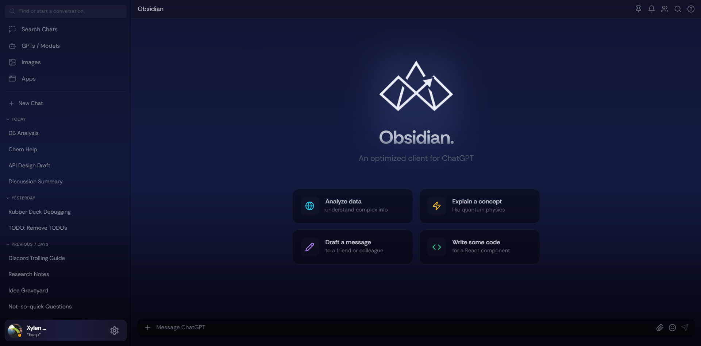

# Obsidian

Obsidian is a powerful, optimized, self-hostable ChatGPT client designed for speed, privacy, and a premium user experience. It is an alternative frontend for chatgpt.com, offering a streamlined interface for interacting with ChatGPT.

> ⚠️ **Work in Progress**
> Obsidian is currently under active development. Some features are incomplete or stubbed, and parts of the interface may change. Core functionality is implemented and usable, but UX and feature completeness are still evolving.



## Features

- **Response Streaming**: Assistant responses are streamed in real-time using Server-Sent Events (SSE).
- **Modern UI/UX**: A clean, responsive interface built with efficiency and usability in mind.
- **Client Mimicry**: Replicates HTTP headers and request characteristics used by the official chatgpt.com client when running in a standard browser environment.
- **Turnstile Handling**: Generates and supplies the Cloudflare, Turnstile, and Sentinel proof-of-work tokens required by the ChatGPT backend.
- **Performance Optimized**: Handles thousands of messages in a single conversation without UI lag.
- **Self-Hostable**: A lightweight Python backend that runs locally in seconds.
- **Secure Credentials**: Obsidian does not collect or store credentials, and sensitive data is sent directly to the ChatGPT backend.

## Project Structure

- `/client`: The frontend application built with React, Vite, and TypeScript.
- `/backend`: The FastAPI server that handles communication with the ChatGPT API.

## Getting Started

To get Obsidian up and running, you'll need to start both the backend and the frontend.
> Alternatively, you can use the hosted frontend at  
> https://obsidianclient.vercel.app/  
> and connect it to your own backend instance.

### 1. Start the Backend

1. Navigate to the `backend` directory.
2. **One-Click Run**:
   - **Windows**: Double-click `run.bat`
   - **Linux/macOS**: Run `chmod +x run.sh && ./run.sh`
3. The server will be running at `http://localhost:8000`.

*See the [backend documentation](backend/README.md) for manual installation steps.*

### 2. Start the Frontend

1. Navigate to the `client` directory.
2. Install dependencies:
   ```bash
   pnpm install
   # or
   npm install
   ```
3. Run the development server:
   ```bash
   pnpm run dev
   ```
4. Open the link displayed in your terminal (usually `http://localhost:5173` or `http://localhost:8080`).

## Configuration

1. **Session Token**: You will need a ChatGPT session token to send messages. You can provide this in the application settings.
2. **Cookies**: Optionally, you can provide full cookie strings to further mimic your specific browser session.
3. **Backend URL**: Optionally, you can provide the URL of the backend server. Defaults to `http://localhost:8000`.

## License

This project is licensed under the [GNU Affero General Public License](LICENSE).

---

Built for a better chat experience.
